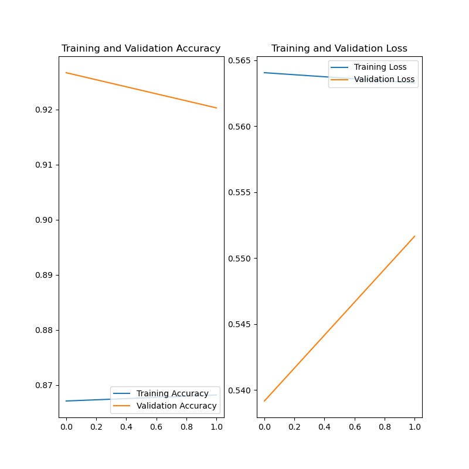
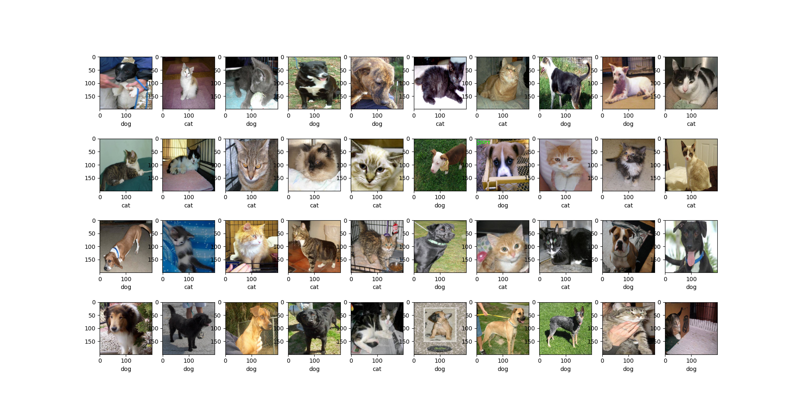

# How to Classify Photos of Dogs and Cats
### Transfer Learning with keras vgg16


## 1. Windows Requirements
1. Tensorflow-GPU 1.15.2
2. Cuda 10.0 (with cudnn)
3. VS Community 2015

## Directory Structure

```
dataset_dogs_vs_cats
├── test
│   ├── cats
│   └── dogs
└── train
    ├── cats
    └── dogs
test
├── images with jpg extension

train_vgg16.py
predict.py
saved_model/
training_1/
```

## 2. Install dependencies
```
pip install -r requirements.txt
```

## 3. Training
```
python train_vgg16.py
```
Accuracy can reach 97% depends on 
[How to Classify Photos of Dogs and Cats (with 97% accuracy)](https://machinelearningmastery.com/how-to-develop-a-convolutional-neural-network-to-classify-photos-of-dogs-and-cats/)



## 4. Predict
```
python predict.py
```



